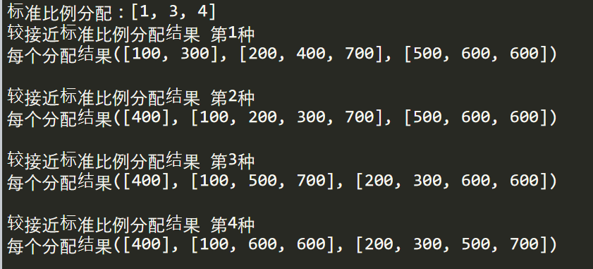
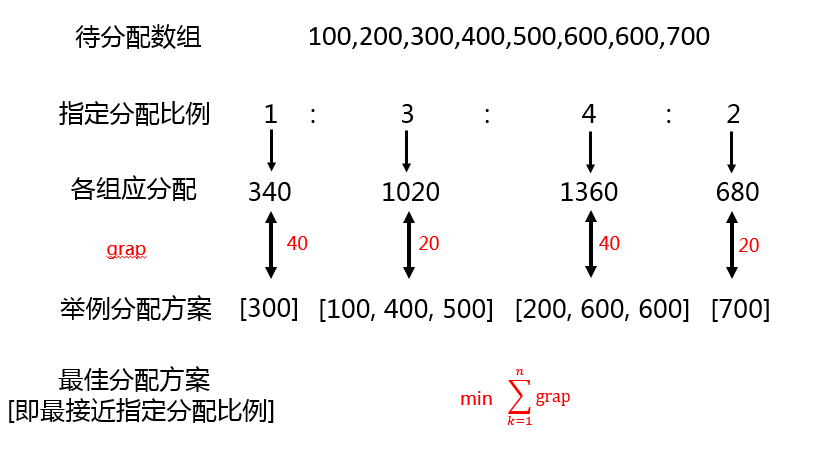

# Question：最佳近似指定比例分配 #

#### 背景：   ####

有8块石头：

| 石头编号 |      | 重量(g) |
| :------: | ---- | ------- |
|    1     |      | 100     |
|    2     |      | 200     |
|    3     |      | 300     |
|    4     |      | 400     |
|    5     |      | 500     |
|    6     |      | 600     |
|    7     |      | 700     |
|    8     |      | 600     |

现按重量来分配比例（1:3:4）分给甲乙丙三人。8块石头总计3400g 则3400/(1+3+4) = 425g。而由于石头的不可分割性，根本无法做到按指定比例分配。那么应该近似分配，做到每个分到的重要近可能接近指定比例。请给出最合理的分配结果。

#### 结果 ####

合理的分配结果有四种，但本质其实是一种，是因为数字怎么加都一样：

1. 甲：石头1(100g) 、石头 3(300g) 

   乙：石头2(200g) 、石头 4(400g) 、石头 7(700g)

   丙：石头5(500g) 、石头 6(600g) 、石头 8(600g)

   甲:乙:丙 = 4:13:17   ≈ 1:3:4

2. 甲：石头4(400g)  

   乙：石头1(100g) 、石头 2(200g) 、石头 3(300g)、石头 7(700g) 

   丙：石头5(500g) 、石头 6(600g) 、石头 8(600g) 

   甲:乙:丙 = 4:13:17   ≈ 1:3:4

3. 甲：石头4(400g)  

   乙：石头1(100g) 、石头 5(500g) 、石头 7(700g)

   丙：石头 2(200g) 、石头 3(300g) 、石头 6(600g) 、石头 8(600g)

   甲:乙:丙 = 4:13:17   ≈ 1:3:4

4. 甲：石头4(400g)  

   乙：石头1(100g) 、石头 6(600g) 、石头 8(600g)

   丙：石头 2(200g) 、石头 3(300g) 、石头 5(500g) 、石头 7(700g)

   甲:乙:丙 = 4:13:17   ≈ 1:3:4

  

#### 分析

存在两个重要问题

1、最接近指定比例的定义是什么？

 2、如何给出详细分配方案？ 

我的解决方案：

**定义**

最佳分配方案[即最接近指定分配比例] = 每组与对应的标准差之和的最小值

**详细分配方法**

Step1：先找与应分配的第一个数较接近的子集。**较接近定义**：(目标值-当前数组最小值) <= 子集之和 <= (目标值+当前数组最小值)。如图举例：先找出子集之和大于等于240^(340-100=240)^小于等于440^(340+100=440)^。满足条件的子集有[100,200]、[100,300]、[300]、[400]，并记录各子集与第一个数的差距(绝对值),分别是40,60,40,60

Step2：找到的子集中循环以下操作：选择一个子集,如==[100,200]==，待分配数组减去该子集，剩余数组[300,400,500,600,600,700]。找出与应分配的第二个数较接近的子集。较接近定义依然使用Step1的定义。即找出剩余数组的子集之和大于等于720^(1020-300)^小于等于1520^(1020+300)^。满足条件的剩余数组的子集有[300,500]、[300,600]、[300,700]、[400,500]、[400,600]、[400,700]、[500,600]、[500,700]、[600,700]、[300,400,500]、[300,400,600]、[300,400,700]、[400,500,600]，同时记录各子集与第二个数的差距(绝对值)

Step3:再在找到的子集循环以下操作：选择一个子集==[300,500]==,剩余数组减去改子集，剩剩余数组[400,600,600,700]。找出与应分配的第三个数较接近的子集。找到的子集重复Step2步骤，直到剩余最后一部分与最后一个数(即第四个)对应,并记录与最后一个的差距。

Step4:现已统计出所有的可能的分配方案。对每个方案下每组的对应的标准差距求和。找出最小值。最小值所在的分配方案即为最佳分配方案，*注意*：一个最小值可能存在多种最佳分配方案。

**小小的优化**：使用itertools.combinations找出所有子集，查看是否满足较接近。因为所有子集(即2^n^个子集)非常多，有些子集显然不满足，可提前过滤，不用找出所有子集。举例：目标值340。数组[100,200,300,400,500,600,600,700]。首先拿出所有子集(即2^8^=256),找出其中满足较接近定义的子集4个。==小优化做法==：目标值340，找出340在数组大概所处的位置,处于300~400之间。索引位置第3位与第4位之间。那么找子集的时候最多取任意3个组合子集就够了。因为取3个以上组合的子集，必有大于340的数，子集的和就更大于340。所有子集(即2^n^个子集)缩小范围为2^3^个子集。   

具体实现见代码    

#### 扩展   ####

给定任意一组待分配集合，按任意指定比例分配。

能按指定比例分配最佳，不能给出，则需给出最接近指定比例分配方案。

不止简单的改变比例值，还允许改变比例的个数。如比例[1:2:3:4] 分四份，现修改为[1:2:3] 分三份，依然能给出最佳分配方案

*难点*：一旦改变比例的个数，需要动态循环嵌套。有N份就要N-1份循环。动态循环嵌套使用递归自身实现

具体实现见代码

#### 后记

总体感觉不是很优雅，但智商有限，目前又想不出更好的idea。若有建议，立刻改进。   

变量命名真是==世纪难题==！太难了 实在想不出应该叫啥才合适    

这一刻我彻底懂得了父母给孩子取名是有多难！   