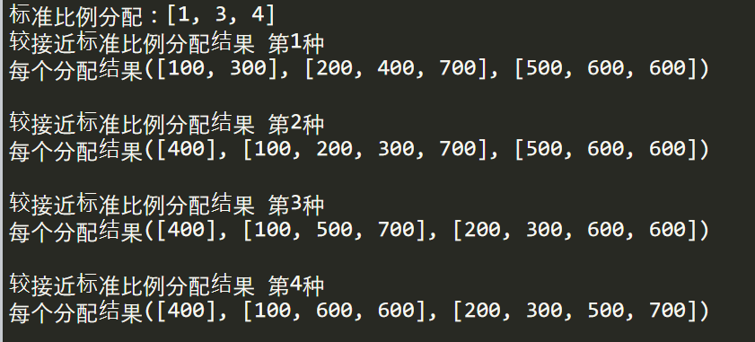

# Question：最佳近似指定比例分配 #

#### 背景：   ####

有8块石头：
序号      数值(重量 g ) 
石头 1        100 
石头 2        200 
石头 3        300 
石头 4        400 
石头 5        500 
石头 6        600 
石头 7        700 
石头 8        600

现按重量来分配比例（1:3:4）分给甲乙丙三人。8块石头总计3400g 则3400/(1+3+4) = 425g。而由于石头的不可分割性，根本无法做到按指定比例分配。那么应该近似分配，做到每个分到的重要近可能接近指定比例。请给出最合理的分配结果。

#### 结果 ####

合理的分配结果有四种，但本质其实是一种，是因为数字怎么加都一样：

1. 甲：石头1(100g) 、石头 3(300g) 

   乙：石头2(200g) 、石头 4(400g) 、石头 7(700g)

   丙：石头5(500g) 、石头 6(600g) 、石头 8(600g)

   甲:乙:丙 = 4:13:17   ≈ 1:3:4

2. 甲：石头4(400g)  

   乙：石头1(100g) 、石头 2(200g) 、石头 3(300g)、石头 7(700g)

   丙：石头5(500g) 、石头 6(600g) 、石头 8(600g)

   甲:乙:丙 = 4:13:17   ≈ 1:3:4

3. 甲：石头4(400g)  

   乙：石头1(100g) 、石头 5(500g) 、石头 7(700g)

   丙：石头 2(200g) 、石头 3(300g) 、石头 6(600g) 、石头 8(600g)

   甲:乙:丙 = 4:13:17   ≈ 1:3:4

4. 甲：石头4(400g)  

   乙：石头1(100g) 、石头 6(600g) 、石头 8(600g)

   丙：石头 2(200g) 、石头 3(300g) 、石头 5(500g) 、石头 7(700g)

   甲:乙:丙 = 4:13:17   ≈ 1:3:4

#### 过程 ####

存在两个重要问题

1、一个石头重量不能拆分 可能会存在不管怎么分都达不到指定比例

 2、要给出每组是怎么相加的  为什么这几个相加？ 

具体过程见代码

#### 扩展 ####

给定任意一组待分配集合，按任意指定比例分配。

能按指定比例分配最佳 

不能给出，则需给出最佳近似指定比例分配方案。

具体见代码